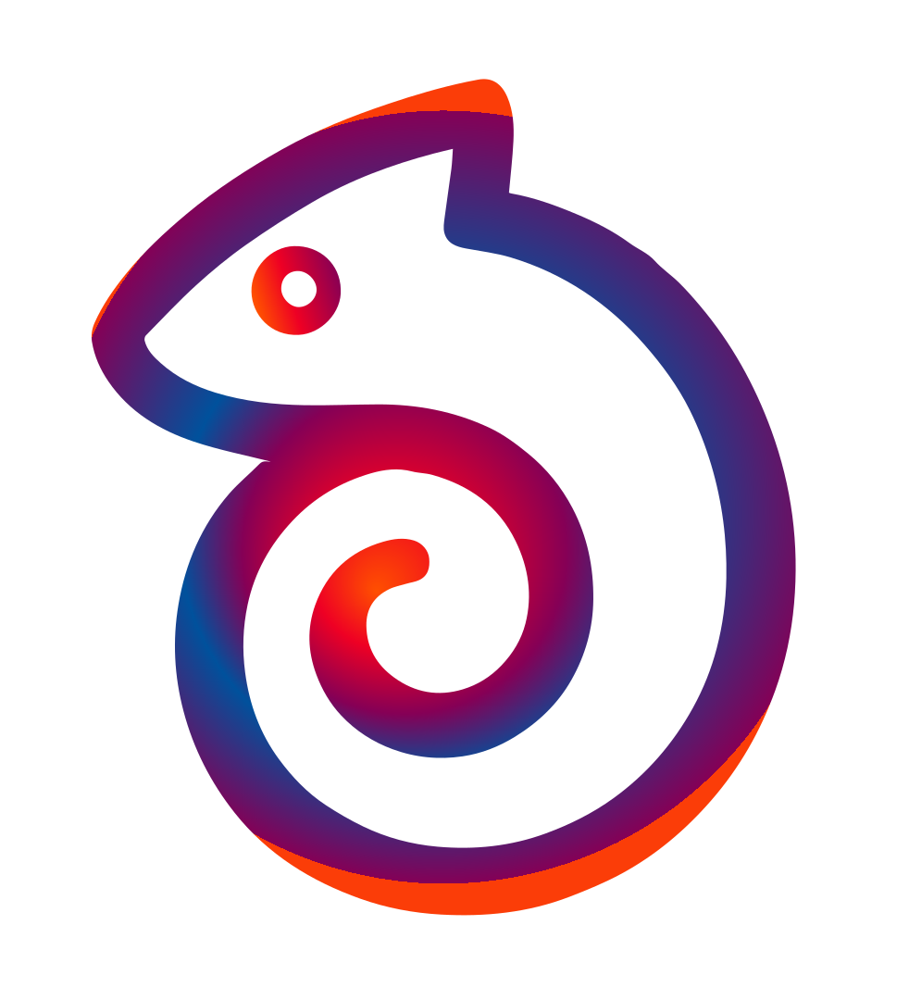

<div align="center">
    
    <h1 align="center">NaturalAgents</h1>
    <div align="center">Easiest way to build agents in a notion-style editor.</div>
</div>

## 😎 Demo

https://github.com/user-attachments/assets/4a2c5c10-e2c0-4b2f-b979-c5a07d42471d


## ⚡ Quick Start

```
docker-compose up --build
```

## 💪 Motivation

We're making it easy for anyone to build Agents and custom workflows with AI using just plain english. We aim to democratize the power of agents to everyone
